# Object Detection


## Project 개요


바야흐로 대량 생산, 대량 소비의 시대. 우리는 많은 물건이 대량으로 생산되고, 소비되는 시대를 살고 있습니다. 하지만 이러한 문화는 '쓰레기 대란', '매립지 부족'과 같은 여러 사회 문제를 낳고 있습니다.

분리수거는 이러한 환경 부담을 줄일 수 있는 방법 중 하나입니다. 잘 분리배출 된 쓰레기는 자원으로서 가치를 인정받아 재활용되지만, 잘못 분리배출 되면 그대로 폐기물로 분류되어 매립 또는 소각되기 때문입니다.

따라서 우리는 사진에서 쓰레기를 Detection 하는 모델을 만들어 이러한 문제점을 해결해보고자 합니다. 문제 해결을 위한 데이터셋으로는 일반 쓰레기, 플라스틱, 종이, 유리 등 10 종류의 쓰레기가 찍힌 사진 데이터셋이 제공됩니다.

여러분에 의해 만들어진 우수한 성능의 모델은 쓰레기장에 설치되어 정확한 분리수거를 돕거나, 어린아이들의 분리수거 교육 등에 사용될 수 있을 것입니다. 부디 지구를 위기로부터 구해주세요! 🌎

* Input : 쓰레기 객체가 담긴 이미지와 bbox 정보(좌표, 카테고리)가 모델의 인풋으로 사용됩니다. bbox annotation은 COCO format으로 제공됩니다.

* Output : 모델은 bbox 좌표, 카테고리, score 값을 리턴합니다. 이를 submission 양식에 맞게 csv 파일을 만들어 제출합니다.

## Data
### 이미지 데이터
전체 이미지 개수 : 9754장
label: General trash, Paper, Paper pack, Metal, Glass, Plastic, Styrofoam, Plastic bag, Battery, Clothing (10 class)
+ Training data: 쓰레기 객체가 담긴 이미지 4883장 (1024x1024)
+ Test Data: 무작위로 선정된 4871장
    * public (대회 진행중)
test.json으로 만든 submission csv 중에 public 데이터만 평가됩니다. 이 때 public 데이터는 평가 데이터의 약 50% 입니다.

    * private (대회 종료후)
test.json으로 만든 submission csv 파일을 통해 모든 평가 데이터가 평가됩니다. 이에 따라 최종 순위가 결정됩니다.
### Annotation file
coco format으로 images와 annotations 정보를 담고 있습니다. 
+ images:
    + id, height, width, filenames
+ annotations
    + id, bbox, area, category_id, image_id

## 평가 방법
* Test set의 mAP50(Mean Average Precision)로 평가

    * Object Detection에서 사용하는 대표적인 성능 측정 방법
    * Ground Truth 박스와 Prediction 박스간 IoU(Intersection Over Union, Detector의 정확도를 평가하는 지표)가 50이 넘는 예측에 대해 True라고 판단합니다.

## Environment
- GPU : V100
- Language : python
- Develop tools : Jupyter Notebook, VSCode
- Using Library : MMDetection, Detectron2, Efficientdet

## Getting Started

- MMDetection : [Usage](./mmdetection/README.md)
- Detectron2 : [Documentation](https://detectron2.readthedocs.io/en/latest/index.html)

## Code Structure
```
├── StratifiedGroupKFold_coco
│   ├── StratifiedGroupKFold.py
│   └── requirements.txt
├── detectron2
│   ├── configs
│   ├── datasets
│   ├── detectron2
│   ├── tools
│   └── setup.py
├── efficientdet
│   ├── dataset.py
│   ├── model.py
│   ├── inference.py
│   ├── train.py
│   └── utils.py
├── mmconfig
│   ├── datasets
│   ├── models
│   ├── runtime
│   ├── schedules
│   ├── test
│   └── utils
├── mmdetection
│   ├── configs
│   │   └── swin
│   ├── mmdet
│   ├── requirements.txt
│   ├── setup.py
│   └── tools
└── tools
    ├── Submission_Visualization.ipynb
    ├── k-fold_kaggle.ipynb
    ├── k-fold_yong.ipynb
    └── metric_skeleton.ipynb

```

## Result


## Contributor
+ 김주영 ([github](https://github.com/JadeKim042386))
+ 오현세 ([github](https://github.com/5Hyeons))
+ 채유리 ([github](https://github.com/yoorichae))
+ 송정현 ([github](https://github.com/pirate-turtle))
+ 배상우 ([github](https://github.com/wSangbae))
+ 최세화 ([github](https://github.com/choisaywhy))
